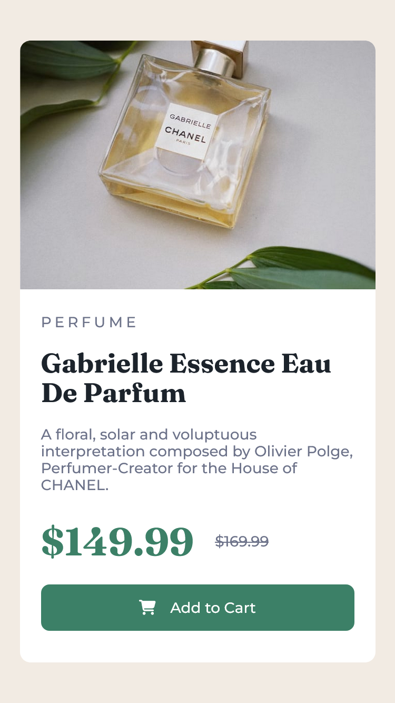
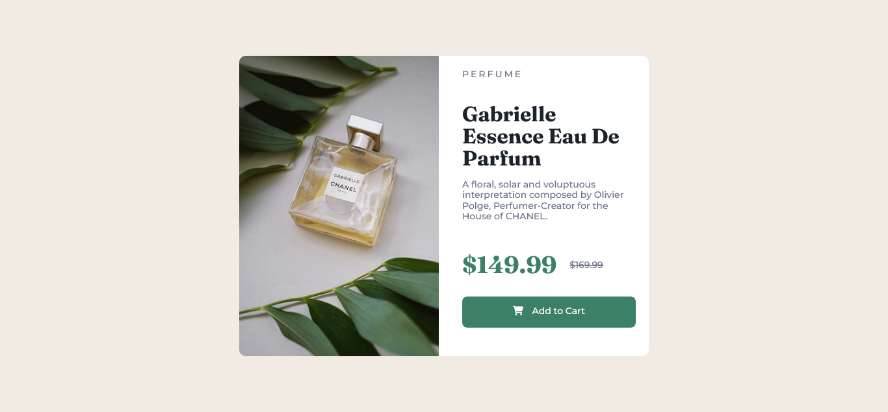

# Product Preview Card Component - Solution


Esta es una forma de solución al proyecto #05 del reto #100daysofprojects. La mejor manera de escribir buen código es programando todos los días🔥.

## Tabla de contenidos

- [Vision general](#vision-general)
  - [El desafio](#el-desafio)
  - [Capturas](#capturas-de-pantalla)
  - [Enlaces](#enlaces)
- [Proceso de trabajo](#proceso-de-trabajo)
  - [Desarrollo](#desarrollo)
  - [Lo que aprendimos](#lo-que-aprendimos)
  - [Lo que aprenderemos](#lo-que-aprenderemos)
  - [Recursos](#recursos)
- [Autor](#autor)
- [Agradecimientos](#agradecimientos)

## Vision general

### El desafio

Tu misión será desarrollar **este componente de tarjeta de vista previa del producto** y lograr que se parezca lo más posible al diseño.

Los usuarios deberían poder:

- Ver el diseño óptimo según el tamaño de pantalla de su dispositivo.
- Ver estados `hover` para los elementos interactivos de la página.

### Capturas de pantalla




### Enlaces

Netlify es nuestro proveedor de hosting gratuito para alojar nuestro sitio web.

- [Pagina web](https://fc-product-preview-card-component.netlify.app/)
- [Codigo fuente](https://github.com/frontend-club/05-day-product-preview-card-component)
- [Codepen](https://codepen.io/frontend-club/pen/WNmaEzM)

## Proceso de trabajo

### Desarrollo

- Marcado HTML
- Propiedades CSS

### Lo que aprendimos

Siempre procuramos de utilizar las etiquetas HTML correctas para marcar el contenido coherente al diseño y los navegadores. Por eso continuamos haciendo uso de la [metodologia BEM](https://getbem.com/introduction/) para tener un código correctamente estructurado y fácil de mantener.

Ejemplo de marcado HTML con BEM.

```html
<main class="container">
  <articulo class="card">
    <div class="card__header">
      <picture>
        <source
          media="(min-width: 1080px)"
          srcset="./images/image-product-desktop.jpg"
        />
        <source
          media="(min-width: 320px)"
          srcset="./images/image-product-mobile.jpg"
        />
        
      </picture>
    </div>
    <div class="card__body">
      <span class="card__tag">Perfume </span>
      <h1 class="card__title">Gabrielle Essence Eau De Parfum</h1>
      <p class="card__copy">
        A floral, solar and voluptuous interpretation composed by Olivier Polge,
        Perfumer-Creator for the House of CHANEL.
      </p>
      <div class="price">
        <span class="price--new">$149.99</span>
        <del class="price--old">$169.99</del>
      </div>
      <div class="button">
        <i class="fa-solid fa-cart-shopping"></i>
        <a href="#" class="btn">Add to Cart</a>
      </div>
    </div>
  </articulo>
</main>
```

Tabla de contenidos para ubicar las propiedades css.

```css
/* -----------------
Tabla de contenidos:
--------------------
1. Fuente ......................... 11
2. Variables ...................... 15
3. Estilos generales .............. 33
4. Estilos container .............. 47
5. Estilos card ................... 59
6. Estilos header ................. 68
7. Estilos body ................... 78
8. Estilos footer ................. 106
-------------------- */
```

### Lo que aprenderemos

Estudiaremos más sobre la metodologia BEM para marcar mejor los elementos HTML.
Investigaremos sobre especificidad y herencia CSS.

### Recursos

Lista de recursos que pueden ayudarte en cualquier proyecto web.

- [BEM Cheat Sheet](https://bem-cheat-sheet.9elements.com/) - Página web con ejemplos e información sobre la metodología BEM.
- [How to Develop and Test a Mobile-First Design in 2021](https://css-tricks.com/how-to-develop-and-test-a-mobile-first-design-in-2021/) - El concepto _mobile-first_

## Autor

Mantengase informado sobre nuestros recursos e iniciativas sobre desarrollo web frontend:

- [Facebook](https://www.facebook.com/frontendclubfb)
- [Instagram](https://www.instagram.com/frontendclubig/)
- [LinkedIn](https://www.linkedin.com/in/frontendclub/)
- [Tik Tok](https://www.tiktok.com/@frontendclub)
- [Twitch](https://www.twitch.tv/frontendclub)
- [Blog](https://frontend-club.bullet.site/)

## Agradecimientos

Agradecemos a los miembros de la comunidad Frontend Club, que nos inspiran a seguir creando contenido y compartiendo iniciativas para ayudar a mejorar las habilidades en HTML, CSS, JavaScript y Git.

> “Yo puedo hacer cosas que tú no puedes, tú puedes hacer cosas que yo no puedo; juntos podemos hacer grandes cosas”. — Madre Teresa de Calcuta.
